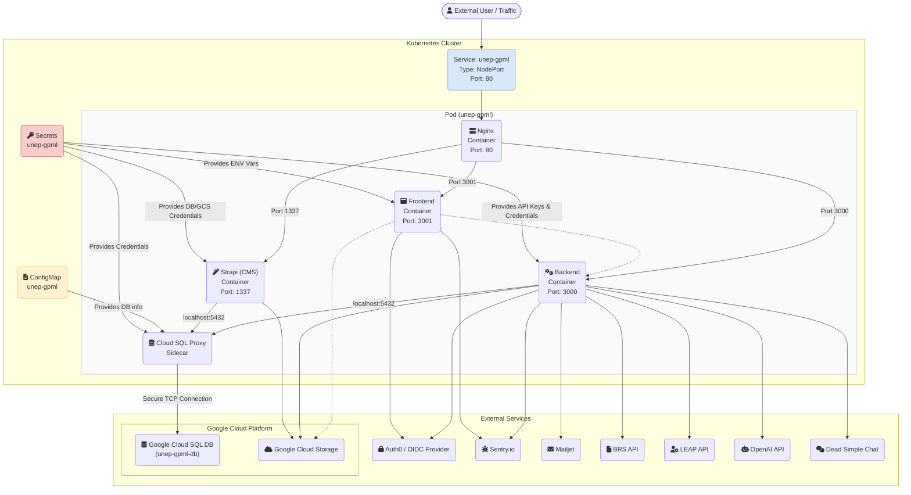
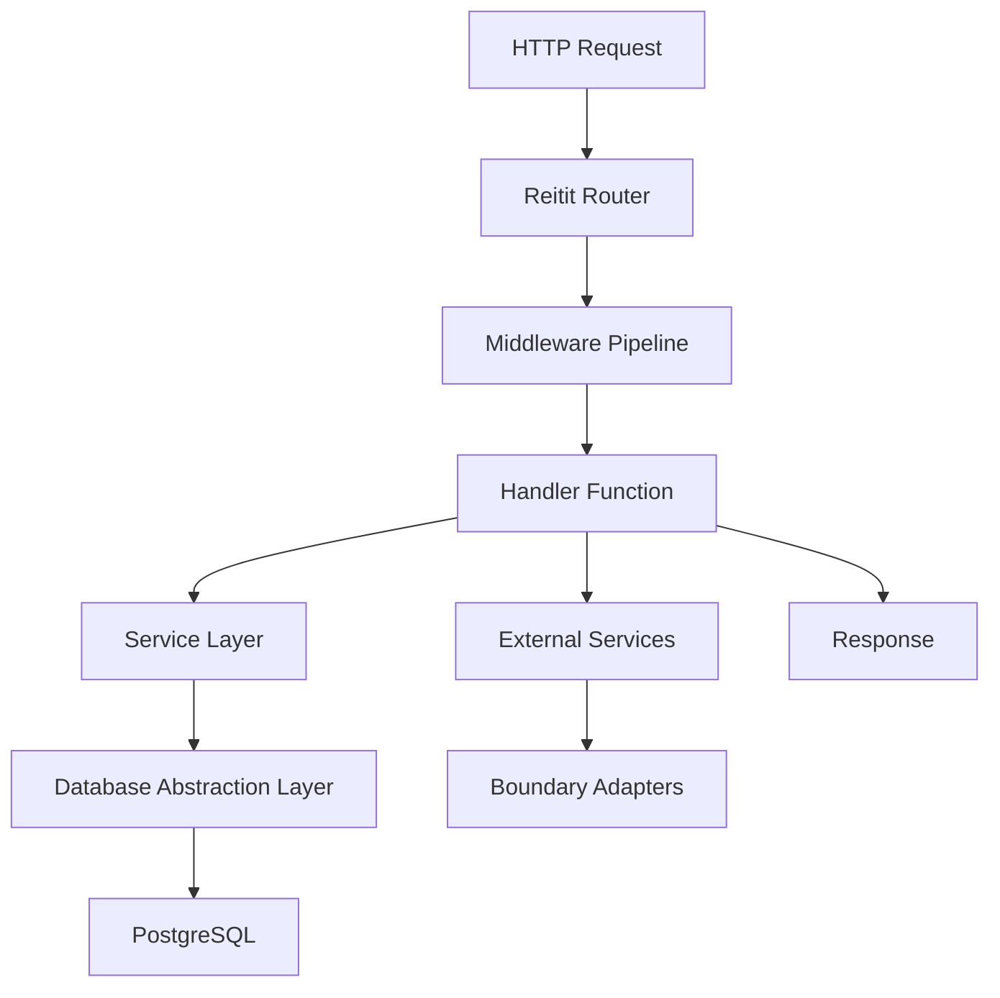

# UNEP - GPML Digital Platform

[](https://akvo.semaphoreci.com/projects/unep-gpml)

## Architecture Diagram



### Technical Architecture Overview

#### Core Application Components

**Nginx (Reverse Proxy)**
- **Technology**: Nginx web server
- **Purpose**: Routes incoming requests to appropriate services, serves static assets, handles SSL termination
- **Location**: `/nginx/` directory with configuration templates
- **Responsibilities**: Load balancing, request routing, static file serving

**Frontend Container**
- **Technology**: Next.js 13+ with React 18
- **Purpose**: User interface for the UNEP GPML platform providing interactive web experience
- **Location**: `/frontend/` directory
- **Responsibilities**: 
  - User authentication and authorization flows
  - Resource browsing and management (policies, technologies, initiatives)
  - Stakeholder networking and profile management
  - Interactive maps and data visualization
  - Multilingual content support (English, French, Spanish)

**Backend Container**
- **Technology**: Clojure with Duct framework, Ring middleware
- **Purpose**: REST API server handling business logic and data operations
- **Location**: `/backend/` directory
- **Responsibilities**:
  - API endpoints for all platform features
  - Authentication and RBAC (Role-Based Access Control)
  - Database operations and data validation
  - Integration with external services (Auth0, cloud storage, email)
  - Background job processing and notifications

**Strapi CMS Container**
- **Technology**: Strapi 4.14+ (Node.js-based headless CMS)
- **Purpose**: Content management system for editorial content
- **Location**: `/strapi/` directory
- **Responsibilities**:
  - Managing static content, news articles, and documentation
  - Content localization and translation workflows
  - Media asset management
  - Admin interface for content editors

**Cloud SQL Proxy (Sidecar)**
- **Technology**: Google Cloud SQL Proxy
- **Purpose**: Secure connection to Google Cloud SQL database
- **Responsibilities**:
  - Encrypted connection to production database
  - Connection pooling and authentication
  - Network security for database access

#### Kubernetes Configuration Components

**ConfigMap**
- **Purpose**: Stores non-sensitive configuration data as key-value pairs
- **Contains**: Database connection info, service URLs, feature flags, environment-specific settings
- **Benefits**: Separates configuration from application code, enables easy environment-specific deployments

**Secrets**
- **Purpose**: Stores sensitive data like passwords, API keys, and certificates
- **Contains**: Database credentials, API keys for external services, authentication tokens
- **Security**: Encrypted at rest, access-controlled, separate from application code

**Service (NodePort)**
- **Purpose**: Exposes the application pod to external traffic
- **Type**: NodePort allows external access through a specific port on each cluster node
- **Routing**: Directs traffic to the Nginx container which then routes to appropriate services

#### External Service Integrations

**Google Cloud Platform**
- **Cloud SQL**: PostgreSQL database with 234+ migrations for comprehensive data model
- **Cloud Storage**: File storage for user uploads, documents, images, and media assets

**Authentication & Security**
- **Auth0/OIDC**: Identity provider for user authentication and authorization
- **Sentry.io**: Error tracking and performance monitoring

**Communication & Data**
- **Mailjet**: Transactional email service for notifications and user communications
- **Dead Simple Chat**: Real-time chat integration for community features
- **BRS/LEAP APIs**: External data sources for environmental policy and legal frameworks
- **OpenAI API**: AI-powered features for content processing and recommendations

This architecture supports the UNEP GPML mission of combating marine litter through a scalable, secure, and internationally accessible platform that connects stakeholders, resources, and knowledge worldwide.

## Backend Architecture Deep Dive

### Duct Framework & Architecture Pattern

The backend uses the **Duct framework**, which implements **Hexagonal Architecture** (Ports & Adapters) with **Component-based Dependency Injection**. Duct is **not an MVC framework** - instead, it provides:

- **Configuration-driven development** using EDN files
- **Integrant-based dependency injection** for managing components
- **Environment-specific profiles** (dev, test, prod)
- **Hot-reloading capabilities** via REPL integration

### Request Processing Flow



#### **Layer Breakdown**

1. **Router Layer**: Reitit matches URLs to handler functions
2. **Middleware Pipeline**: CORS, authentication, validation, exception handling
3. **Handler Layer**: HTTP request/response handling with parameter extraction
4. **Service Layer**: Business logic, transactions, and complex operations
5. **Database Abstraction Layer**: Unified interface supporting both query approaches
   - **HugSQL**: Template-based queries from `.sql` files (90% of queries)
   - **HoneySQL**: Programmatic query building (complex dynamic queries)
   - **gpml.db/execute!**: Single function that handles both formats
6. **External Services**: Auth0, cloud storage, email, chat via boundary adapters

### Codebase Organization by Functionality

#### **Core Application Structure (`/backend/src/gpml/`)**

```
backend/src/gpml/
├── main.clj                    # Application entry point & bootstrap
├── handler/                    # HTTP request handlers (Controllers)
│   ├── stakeholder.clj         # User management endpoints
│   ├── policy.clj             # Policy resource endpoints
│   ├── initiative.clj         # Initiative resource endpoints
│   ├── resource/              # Nested resource handlers
│   └── plastic_strategy/      # Plastic strategy feature
├── domain/                     # Business logic & data models
│   ├── stakeholder.clj         # User entity definitions
│   ├── policy.clj             # Policy entity schemas
│   └── types.clj              # Common type definitions
├── db/                        # Database access layer
│   ├── stakeholder.clj + .sql  # User data operations
│   ├── policy.clj + .sql      # Policy data operations
│   └── resource/              # Resource-specific queries
├── service/                   # Business logic orchestration
│   ├── stakeholder.clj        # User management services
│   ├── permissions.clj        # RBAC authorization
│   └── file.clj              # File handling logic
├── boundary/                  # External system integration
│   ├── port/                 # Interface definitions (protocols)
│   └── adapter/              # Concrete implementations
├── scheduler/                 # Background jobs & tasks
├── util/                     # Cross-cutting utilities
└── auth.clj                  # Authentication utilities
```

### Where to Find Functionality

#### **🔍 Adding New API Endpoints**
1. **Create Handler**: `/handler/your-feature.clj`
   ```clojure
   (defmethod ig/init-key :gpml.handler.your-feature/list [_ {:keys [db]}]
     (fn [{:keys [parameters]}]
       (response (db.your-feature/list-items (:spec db) parameters))))
   ```

2. **Register Routes**: Add to `/resources/gpml/duct.base.edn`
   ```clojure
   [:duct.router/reitit :gpml.main/router]
   {:routes ["/api"
             ["/your-feature" {:handler #ig/ref :gpml.handler.your-feature/list}]]}
   ```

#### **🗄️ Database Operations**
1. **SQL Queries**: `/db/your-feature.sql`
   ```sql
   -- :name list-items :? :*
   SELECT * FROM your_table WHERE status = :status
   ```

2. **Clojure Functions**: `/db/your-feature.clj`
   ```clojure
   (ns gpml.db.your-feature
     (:require [hugsql.core :as hugsql]))

   (hugsql/def-db-fns "gpml/db/your-feature.sql")
   ```

#### **🔐 Authentication & Authorization**
- **Auth Logic**: `/util/auth0.clj` - JWT token handling
- **RBAC**: `/service/permissions.clj` - Role-based access control
- **Middleware**: Declarative auth in route definitions

#### **📊 Business Logic**
- **Domain Models**: `/domain/` - Entity schemas and validation
- **Services**: `/service/` - Complex operations and transactions
- **Utilities**: `/util/` - Reusable helper functions

#### **🔌 External Service Integration**
1. **Define Interface**: `/boundary/port/your-service.clj`
   ```clojure
   (defprotocol YourService
     :extend-via-metadata true
     (^{:schema [:or (success-with :data any?) (failure-with :error any?)]}
       do-something [this params]))
   ```

2. **Implement Adapter**: `/boundary/adapter/your-service/implementation.clj`
   ```clojure
   (defn map->YourServiceAdapter [config]
     {:pre [(check! [:map [:api-key string?]] config)]}
     (with-meta config
       {`port.your-service/do-something do-something*}))

   (defmethod ig/init-key :gpml.boundary.adapter.your-service/impl
     [_ config]
     (map->YourServiceAdapter config))
   ```

3. **Implementation Function**:
   ```clojure
   (defn do-something* [{:keys [api-key logger]} params]
     (try
       {:success? true :data (call-external-api api-key params)}
       (catch Exception e
         {:success? false :error-details (ex-message e)})))
   ```

#### **⚙️ Configuration Management**
- **Base Config**: `/resources/gpml/duct.base.edn`
- **Environment Profiles**: `/resources/gpml/duct.edn` (dev), `/resources/gpml/duct.prod.edn`
- **Local Overrides**: `/dev/resources/local.edn`

#### **🔄 Background Jobs**
- **Schedulers**: `/scheduler/` - Periodic tasks and background processing
- **Examples**: BRS API import, chat processing, file reconciliation

### Key Development Patterns

#### **Component Lifecycle**
```clojure
(defmethod ig/init-key :your.component/name [_ config]
  (-> config
      (setup-component)
      (start-component)))

(defmethod ig/halt-key! :your.component/name [_ component]
  (stop-component component))
```

#### **Database Transaction Pattern**
```clojure
(defn create-stakeholder! [db stakeholder-data]
  (jdbc/with-transaction [tx (:spec db)]
    (let [stakeholder-id (db.stakeholder/new-stakeholder tx stakeholder-data)]
      (db.rbac/assign-default-permissions tx stakeholder-id)
      stakeholder-id)))
```

#### **Malli Schema Validation**
```clojure
(def CreateStakeholderRequest
  [:map
   [:email [:string {:min 1}]]
   [:first_name [:string {:min 1}]]
   [:country [:int {:min 1}]]])
```

This architecture provides strong separation of concerns, making it easy to locate and modify functionality while maintaining system integrity and testability.

### HugSQL vs HoneySQL: Two Query Approaches

The backend uses both **HugSQL** (primary) and **HoneySQL** (selective) for different query complexity needs.

#### **HugSQL - Template-Based Queries**
```clojure
-- SQL file: /db/stakeholder.sql
-- :name get-stakeholder-by-id :? :1
SELECT * FROM stakeholder WHERE id = :id

-- Clojure file: /db/stakeholder.clj
(hugsql/def-db-fns "gpml/db/stakeholder.sql")
(get-stakeholder-by-id db {:id 123})
```

#### **HoneySQL - Programmatic Queries**
```clojure
(def query
  {:select [:*]
   :from [:stakeholder]
   :where [:and
           [:= :status "APPROVED"]
           (when country [:= :country country])]})
```

#### **When Each Is Used**

| Use Case | HugSQL | HoneySQL |
|----------|--------|----------|
| **Simple CRUD** | ✅ Direct SQL, fast execution | ❌ Overhead for simple queries |
| **Static Reports** | ✅ Clear SQL structure | ❌ Unnecessary complexity |
| **Dynamic Queries** | ❌ String concatenation pain | ✅ Clean programmatic building |
| **Complex Conditions** | ❌ Hard to maintain | ✅ Composable logic |

#### **Current Usage in Codebase**

**HugSQL (90% of queries)**:
- `/backend/src/gpml/db/stakeholder.sql` - User CRUD operations
- `/backend/src/gpml/db/policy.sql` - Resource management
- Most static queries with known structure

**HoneySQL (10% of queries)**:
- `/backend/src/gpml/db/topic.clj:270-305` - Complex dynamic filtering
- Infrastructure in `/backend/src/gpml/db.clj` - Supports both formats

#### **Example: Complex Query Challenge**

**HugSQL Approach (Current Pain Point)**:
```clojure
(str "SELECT * FROM " table
     " WHERE 1=1"
     (when id " AND id = :id")
     (when status " AND status = :status")
     (when country " AND country = :country"))
```

**HoneySQL Alternative**:
```clojure
{:select [:*]
 :from [table]
 :where (cond-> [:= 1 1]
          id (conj [:= :id :id])
          status (conj [:= :status :status])
          country (conj [:= :country :country]))}
```

#### **Development Guidelines**

**Choose HugSQL for**:
- Simple CRUD operations
- Static queries with fixed structure
- PostgreSQL-specific features
- When SQL readability is priority

**Choose HoneySQL for**:
- Dynamic query construction
- Complex conditional logic
- Queries built from user input
- When composability is needed

The hybrid approach allows using the most appropriate tool for each query type while maintaining a unified database interface through `gpml.db/execute!`.

## Development

### Requirements

* [docker-compose](https://docs.docker.com/compose/)


### Usual commands

* Start the development environment: `docker-compose up -d`
* Stop dev environment: `docker-compose down`
* If you want to clean up all the stored data use `-v`: `docker-compose down -v`

Website will be available at [http://localhost:3001](http://localhost:3001).

After you signup, you can approve your user and make him admin with:

    docker compose exec db psql -U unep -d gpml -c "UPDATE stakeholder SET review_status='APPROVED', role='ADMIN' WHERE email='<your email here>'"


### Backend development

Backend API is available at [http://localhost:3000](http://localhost:3000)

#### Connect to REPL

You can connect to the REPL using your IDE tools or using the backend container

```
docker compose exec backend lein repl :connect localhost:47480
```

The REPL (Read-Eval-Print Loop) enables **interactive Clojure development** where you can:

**Common Use Cases:**
- **Live Code Reloading**: Make changes and reload without restarting the server
- **Interactive Development**: Test functions as you write them with real data
- **System Administration**: Create users, query database state, test API endpoints
- **Debugging**: Inspect running system state and experiment with data transformations
- **Hot-fixing**: Fix data inconsistencies or test fixes on the fly

**Typical REPL Workflow:**
```clojure
;; Test functions immediately
(db/get-stakeholder-by-email "user@example.com")

;; Experiment with data transformations
(->> (db/get-policies)
     (filter #(= (:status %) "APPROVED"))
     (map :title)
     (take 5))

;; Create users programmatically
(make-user! "admin@example.com")
```

This makes Clojure development incredibly productive compared to traditional compile-restart-test cycles.

#### Creating a super admin user

Run the following command in the REPL

```clojure
(make-user! "<user email here>")
```

Run the following command in the terminal shell

```
docker compose exec db psql -U unep -d gpml -c "UPDATE stakeholder SET review_status='APPROVED', role='ADMIN' WHERE email='<your email here>'"
docker compose exec db psql -U unep -d gpml -c "INSERT INTO rbac_super_admin(user_id) SELECT id FROM stakeholder WHERE email='<user email here>'"
```

#### Reload code changes

To "injects" the new bytecode into the running JVM, run the following command in the REPL

```clojure
(refresh)
(go)
```

#### Local config file

Copy the `backend/dev/resources/local.example.edn` file to `backend/dev/resources/local.edn`.

The `local.edn` file configures **development-specific overrides** for the Clojure application:

**Main Configuration Areas:**
- **Authentication Bypassing**: Disables authentication checks during development for easier API testing
- **Middleware Replacement**: Replaces production authentication middleware with bypass middleware
- **Service Mocking**: Replace external services (chat, storage) with local mocks
- **Enhanced Logging**: Enable detailed console logging for debugging

**Development Benefits:**
- **No Auth Required**: Test APIs without managing JWT tokens
- **Local Storage**: Avoid cloud storage setup during development  
- **Quick Iteration**: Modify config and reload instantly via REPL `(refresh)` and `(go)`
- **Service Independence**: Test without external dependencies

#### Print log to the stdout

Logs are helpful when debugging errors. Edit `backend/dev/resources/local.edn` and add the following lines

```clojure
{
  ;; ...

  ;; print log to stdout
  :duct.logger.timbre/println   {}
  :duct.logger/timbre           {:set-root-config?  true
                                 :level             :info
                                 :appenders         {:println #ig/ref :duct.logger.timbre/println}}
  ;; ...
}
```

#### Store uploaded image to local storage

Edit `backend/dev/resources/local.edn` and add the following lines

```clojure
{
  ;; ...

  [:duct/const :gpml.config/common] {:storage-client-adapter #ig/ref :mocks.boundary.adapter.storage-client/local-file-system
                                     :storage-bucket-name #duct/env ["LOCAL_FS_STORAGE_BUCKET_NAME" Str]}
  ;; ...
}
```

**When Local Storage is Useful:**
- **Quick Development Setup**: New developers can start immediately without cloud storage credentials
- **Faster Development Cycle**: No network latency, offline development, faster tests
- **Cost Savings**: Avoid cloud storage charges during development
- **Easy Debugging**: Direct file access for inspecting uploaded content (user avatars, organization logos, documents)
- **Test Data Management**: Simply delete local folders to reset test state

#### Mock the chat service

Edit `backend/dev/resources/local.edn` and add the following lines

```clojure
{
  ;; ...

  :mocks.boundary.adapter.chat/ds-chat  {}
  [:duct/const :gpml.config/common]     {:chat-adapter  #ig/ref :mocks.boundary.adapter.chat/ds-chat}

  ;; ...
}
```

**What Still Works with Chat Mocking:**
- **API Endpoints**: Chat routes respond successfully with proper validation
- **Database Operations**: Channel metadata, user memberships, permissions, bookmarks
- **Application Logic**: Channel creation for plastic strategies, team management, invitation workflows

**What Won't Work:**
- **Real-time Messaging**: No actual message sending/receiving or live updates
- **External Integration**: No Dead Simple Chat server connection
- **Live Communication**: No team collaboration, file sharing within chat, or user presence tracking

**Development Strategy**: Use mocks for rapid API/logic development, test with real chat service in staging for integration validation.

### Local Development Notes and Considerations

Currently, our local development setup doesn't fully support integrated frontend and backend services. This is because our frontend and backend teams work independently, communicating their needs and changes without directly interacting with each other's codebases. As a result, seamless local integration hasn't been a high priority.

Typically, the backend team tests their APIs locally using dummy data to ensure they meet requirements. Meanwhile, the frontend team develops by connecting to the API deployed on the testing server, utilizing the data already present there.

#### Potential Local Development Issues

You might encounter a couple of issues when trying to integrate locally:

**1. API Proxy Configuration:**

- The frontend's default backend target is http://backend:3000 (found in `frontend/next.config.js:65`).
- This won't resolve correctly due to how our Docker Compose networking is set up.

**2. Missing Auth0 Credentials:**

- While some Auth0 environment variables are in place, they may lack actual values for complete functionality.
- We don't currently have a dedicated Auth0 account for local development.
- We also don't use a local Auth0 mock service, so local development doesn't inherently require connecting to Auth0.

#### Workarounds for Local Development
To overcome these challenges, here are some workarounds:

**Frontend Development**
- Set `REACT_APP_FEENV=true`: This environment variable configures your local frontend to connect directly to the backend running on the test server.

**Backend Development**
- Bypass Authentication (Recommended for local dev): You can bypass Auth0 authentication by modifying your `backend/dev/resources/local.edn` file.
- Use Auth0 Authentication (Optional): If you need to test with Auth0, you'll have to:
  * Create a user in your local Auth0 with the exact same email as a user on the test server.
  * Obtain an Auth0 token from the test server. The easiest way to get this token is to:
    - Log in to the test server.
    - Go to your user profile page.
    - Open your browser's network traffic inspection tools.
    - Refresh the profile page.
    - Find the /profile endpoint request and copy the value from its Authorization header.
